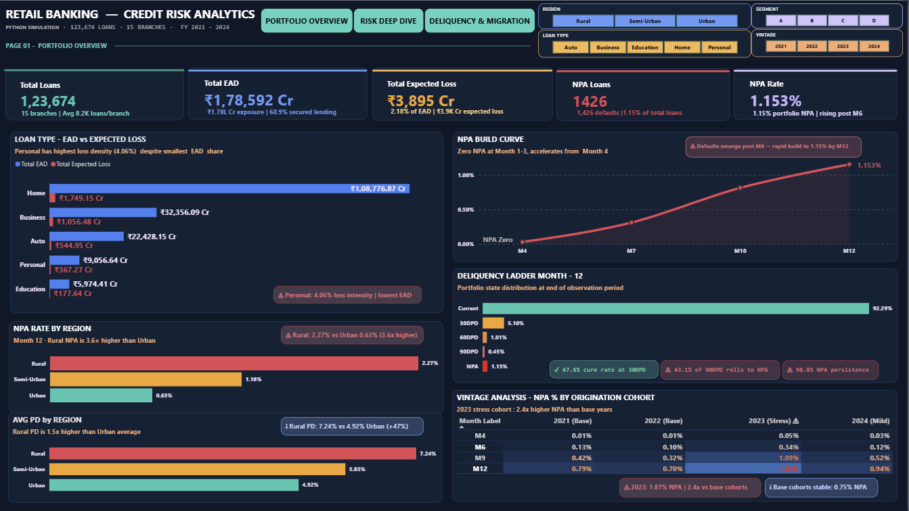

🏦 Retail Banking Credit Risk Analytics

📌 Project Overview

This project presents an end-to-end Credit Risk Analytics solution using synthetic banking data. The workflow includes data simulation (Python), SQL analysis (18 case studies), and an interactive Power BI dashboard to analyse portfolio risk using PD, LGD, EAD, and delinquency metrics.

---

🖼️ Dashboard Overview

📊 Portfolio Overview

"Portfolio Overview" (Retail_banking_dashboard.png)

🔍 Key Visuals & Explanation

- Total Portfolio Metrics
  
  - Total Loans: 1,23,674
  - Total EAD: ₹1.78L Cr
  - Expected Loss: ₹3.9K Cr
  - NPA Rate: ~1.15%
    👉 Provides a snapshot of overall portfolio health

- Loan Type: EAD vs Expected Loss
  👉 Compares exposure and risk contribution across loan types
  👉 Personal loans contribute disproportionately higher loss relative to exposure

- NPA Rate by Region
  👉 Highlights regional variation in default rates
  👉 Rural regions show higher NPA concentration

- Average PD by Region
  👉 Shows variation in default probability across regions
  👉 Rural segments exhibit elevated risk compared to urban

- NPA Build Curve
  👉 Tracks how defaults accumulate over loan lifecycle
  👉 Defaults accelerate after mid-tenure

---

📊 Risk Deep Dive

.png)

🔍 Key Visuals & Explanation

- Portfolio Risk Metrics
  
  - Avg PD: ~5.7%
  - Avg LGD: ~49.5%
  - EL Ratio: ~2.18%
    👉 Measures probability, severity, and overall loss

- Portfolio Growth Trend
  👉 Loan growth across years
  👉 2023 cohort shows both peak growth and elevated risk

- Credit Score Segmentation
  👉 Risk increases as credit score declines
  👉 Subprime segment drives higher default probability

- Branch Risk Comparison
  👉 Identifies high-risk branches based on PD
  👉 Helps target risk monitoring efforts

- Expected Loss Decomposition
  👉 Breaks EL into PD × LGD × EAD components
  👉 Helps understand key drivers of loss

---

📊 Delinquency & Migration

.png)

🔍 Key Visuals & Explanation

- Cure Rate (30DPD)
  👉 ~48% of loans recover from early delinquency
  👉 Indicates effectiveness of early intervention

- Roll Rates (30→60, 90→NPA)
  👉 ~9% move to higher delinquency from 30DPD
  👉 ~43% of 90DPD loans convert to NPA
  👉 Shows escalation of risk in later stages

- State Transition Matrix
  👉 Displays probability of movement across DPD states
  👉 Helps understand delinquency behaviour

- Delinquency Ladder (M12)
  👉 ~92% loans remain current
  👉 Small share moves into delinquency buckets

- Vintage Analysis
  👉 Tracks cohort-level NPA trends over time
  👉 2023 cohort shows highest NPA buildup

---

🔄 End-to-End Workflow

1️⃣ Data Simulation (Python)

- Synthetic dataset created to simulate real banking portfolio
- Includes loan lifecycle, delinquency transitions, and risk profiles

2️⃣ SQL Analysis (18 Case Studies)

- Portfolio segmentation
- Risk analysis
- Delinquency trends
- Cohort and roll rate analysis

3️⃣ Power BI Dashboard

- Interactive visuals for portfolio monitoring
- Risk segmentation and trend analysis

---

💡 Key Insights

- Personal loans drive higher loss intensity
- Rural regions exhibit higher credit risk
- Defaults accelerate after mid-tenure
- Subprime borrowers contribute most to risk
- Late-stage delinquency has high default conversion

---

⚠️ Disclaimer

- Dataset is synthetic and used for analysis purposes
- Metrics reflect portfolio-level (unfiltered) view

---

🛠️ Tools Used

- Python — Data simulation
- SQL — Analysis
- Power BI — Visualization

---

👤 Author

Jayakrishnan K
